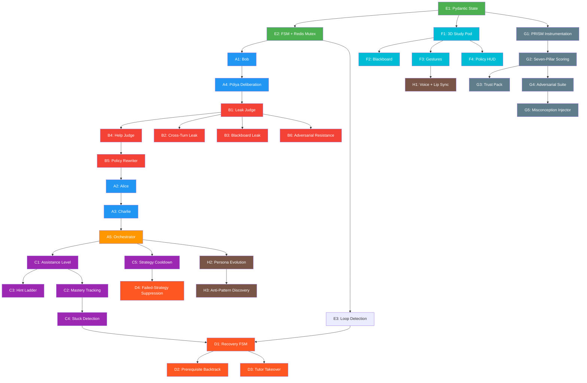

# Spatial PeerRing — Feature Development Roadmap

> Extracted from [Spatial-PeerRing-Consolidated-PRD.md](file:///c:/Users/ceusm/peerring/Spatial-PeerRing-Consolidated-PRD.md) and [PRISM-Integration-Guide.md](file:///c:/Users/ceusm/peerring/PRISM-Integration-Guide.md).
> 8 Epics → 28 consolidated capabilities → 4 development phases.

---

## Feature Inventory by Category

### 🤖 Category A — Agent Intelligence & Pedagogy
*Core teaching engine: the agents, their reasoning, and the orchestration logic.*

| # | Feature | Epic | Priority | Description |
|---|---------|------|----------|-------------|
| A1 | Bob (Socratic Tutor) | Epic 1 | P0 | Diagnoses learner state, plans the next pedagogical move, never solves the problem directly. |
| A2 | Alice (Arithmetic-Error Peer) | Epic 1 | P0 | Conceptually correct peer that introduces controlled operational/arithmetic mistakes for the learner to catch. |
| A3 | Charlie (Conceptual-Error Peer) | Epic 1 | P0 | Procedurally correct peer that introduces controlled theoretical mistakes — distinct error class from Alice (no overlap). |
| A4 | Latent Pólya Deliberation | Epic 1 | P0 | Every agent reasons inside a hidden `<think>` block (Understand → Plan → Execute → Look Back) before emitting visible text; policy self-checks happen here. |
| A5 | Pedagogical Orchestrator | Epic 1 | P0 | Each agent proposes a candidate action; a lightweight orchestrator scores candidates against learner state and picks the next speaker/strategy. Replaces hardcoded turn scripts. |

---

### 🛡️ Category B — Answer Governance & Guardrails
*Non-negotiable trust layer — the product's core differentiator.*

| # | Feature | Epic | Priority | Description |
|---|---------|------|----------|-------------|
| B1 | Leak Judge | Epic 2 | P0 | Out-of-band classifier that blocks any response containing a terminal or reconstructible solution before it reaches the client. |
| B2 | Indirect / Cross-Turn Leak Detection | Epic 2 | P0 | Evaluates leakage across recent dialogue history, not just the current message (catches split leaks across agents/turns). |
| B3 | Blackboard Leakage Protection | Epic 2 | P0 | Shared blackboard patches run through the same Leak Judge as spoken text — visuals can't bypass policy. |
| B4 | Help Judge | Epic 2 | P0 | Second-pass check: did the (non-leaking) response actually move the learner forward, or is it safe-but-useless? |
| B5 | Policy Rewriter | Epic 2 | P0 | On rejection, regenerates the response using the specific violation reason rather than returning a generic error. |
| B6 | Adversarial Prompt Resistance | Epic 2 | P0 | Classifies user intent (`ADVERSARIAL_REQUEST`, `ANSWER_REQUEST`, etc.) and routes high-pressure/injection attempts through stricter policy before generation. |

---

### 🧠 Category C — Adaptive Learning & Personalization
*Behavior-based adaptation that personalizes difficulty and assistance in real time.*

| # | Feature | Epic | Priority | Description |
|---|---------|------|----------|-------------|
| C1 | Behavior-Derived Assistance Level | Epic 3 | P0 (lightweight) | Learner starts at "medium" policy; level adjusts up/down based on live performance signals (consecutive errors, hint dependency, confidence, response latency). |
| C2 | Concept-Level Mastery Tracking | Epic 3 | P1 | Mastery tracked per curriculum-DAG node (e.g., `distributive_property: 0.42`), not as one global score. |
| C3 | Escalating Hint / Intervention Ladder | Epic 3 | P0 (lightweight) | 5–6 fixed levels from "conceptual question" to "worked micro-step"; climbs only as needed, steps back down as learner recovers (Dynamic Return to Independence). |
| C4 | Struggle / Stuck Detection | Epic 3 | P1 | Composite score from repeated errors, repeated questions, and lack of mastery movement; triggers recovery flow. |
| C5 | Strategy Diversity + Cooldown | Epic 3 | P1 | Peers/strategies that were just used (or just failed) enter a short cooldown so the same move isn't repeated back-to-back. |

---

### 🔄 Category D — Pedagogical Recovery
*Fires only when the learner is stuck — keeps the session from looping.*

| # | Feature | Epic | Priority | Description |
|---|---------|------|----------|-------------|
| D1 | Recovery State Machine | Epic 4 | P1 | `NORMAL → SCAFFOLD → PREREQUISITE_REPAIR → MICRO_TEACHING → REASSESS`, replacing an infinite hint→hint→hint chain. |
| D2 | Prerequisite Backtracking | Epic 4 | P1 | If the blocker is a lower-level concept, temporarily drop down the curriculum DAG, remediate, then return. |
| D3 | Temporary Tutor Takeover | Epic 4 | P1 | After repeated failed peer interventions, Bob takes direct (still non-disclosing) control for one micro-step, then hands back to the peer flow. |
| D4 | Failed-Strategy Suppression | Epic 4 | P1 | Tracks which strategies already failed this session and excludes them from the orchestrator's candidate set. |

---

### ⚙️ Category E — Infrastructure & Reliability
*State management, concurrency control, and latency.*

| # | Feature | Epic | Priority | Description |
|---|---------|------|----------|-------------|
| E1 | Centralized Pydantic State | Epic 5 | P0 | Single shared state object (problem, step, mastery, policy, dialogue history) all agents read/write — prevents agents disagreeing. |
| E2 | Turn Allocator (FSM) + Redis Mutex | Epic 5 | P0 | `SETNX session:turn_lock` + deterministic `AGENT_RESPONSE → CLIENT_ACK → TURN_COMPLETE → release lock` handshake. Dynamic speaker selection layered on top. |
| E3 | Conversation Loop Detection | Epic 5 | P0 | Hashes (concept + step + misconception + recent actions); repeated-state cycles force a strategy change via recovery flow. |
| E4 | Latency Mitigation | Epic 5 | P0 | Fast inference endpoint + async judges (<250ms) + optimistic "thinking" animation so judge latency doesn't stall the UI. |

---

### 🎨 Category F — Spatial Presentation Layer
*3D environment, blackboard, and real-time visual feedback.*

| # | Feature | Epic | Priority | Description |
|---|---------|------|----------|-------------|
| F1 | 3D Study Pod | Epic 6 | P0 | React Three Fiber scene with low-poly GLTF avatars for Bob/Alice/Charlie/User; <15k polys, Draco-compressed, texture-atlased. |
| F2 | Dynamic Blackboard | Epic 6 | P0 | SVG/KaTeX canvas synced via `blackboard_patch` events, governed by the same Leak Judge as chat. |
| F3 | Agent Gestures / Spatial State | Epic 6 | P0 | `GESTURE_TRIGGER` events map to idle/speaking/thinking/pointing states per active speaker. |
| F4 | Live Policy HUD | Epic 6 | P0 | Shows current speaker, policy status, leak-check result, mastery, and system state in real time (demo/trust signal). |

---

### 📊 Category G — Observability & Evaluation (PRISM)
*The audit trail: Build → Observe → Improve → Prove.*

| # | Feature | Epic | Priority | Description |
|---|---------|------|----------|-------------|
| G1 | Full-Pipeline Instrumentation | Epic 7 | P0 | Every turn logs input, latent trace, visible output, judge verdicts, state transition, and latency to Block Convey PRISM. |
| G2 | Seven-Pillar Scoring | Epic 7 | P0 | Guardrails, Friction, Task Success, Correctness, Stability, Improvement Velocity + Learning Progress (`mastery_after − mastery_before`). |
| G3 | Baseline-vs-Upgraded Trust Pack | Epic 7 | P1 | Automated comparison report (radar chart, before/after scores) for the Build→Observe→Improve→Prove narrative. |
| G4 | Adversarial Evaluation Suite | Epic 7 | P1 | Scripted test suite covering answer-forcing, injection, deadline pressure, repeated requests, and conversational loops. |
| G5 | Synthetic Misconception Injector | Epic 7 | P1 | Background agent that auto-generates adversarial/struggling-student traffic to stress-test live during a demo. |

---

### ✨ Category H — Immersion Polish
*Premium experience features for long-term product differentiation.*

| # | Feature | Epic | Priority | Description |
|---|---------|------|----------|-------------|
| H1 | Voice + Lip Sync | Epic 8 | P2 | Web Speech API + per-agent voice profile + jaw-bone viseme animation. |
| H2 | Peer Persona Evolution | Epic 8 | P2 | Alice/Charlie remember being corrected and can reference it later ("Last time I forgot to distribute to both terms"). |
| H3 | Anti-Pattern-Discovery | Epic 8 | P2 | Randomizes *when* each peer's error type shows up so students can't game prediction of who makes which mistake. |

---

## Phase-by-Phase Development Plan

### 🚀 Phase 1 — Foundation (MVP / Hackathon Demo)
**Goal:** End-to-end working loop — user sends a message, agents respond in a governed 3D environment, PRISM records it.
**Duration estimate:** 2–3 weeks

| Order | Feature | ID | Rationale |
|-------|---------|-----|-----------|
| 1.1 | Centralized Pydantic State | E1 | Everything reads/writes this — must exist first. |
| 1.2 | Turn Allocator (FSM) + Redis Mutex | E2 | Concurrency safety before any agent logic fires. |
| 1.3 | Bob (Socratic Tutor) | A1 | Core teaching agent; simplest agent to build first. |
| 1.4 | Latent Pólya Deliberation | A4 | Bob needs `<think>` reasoning from day one. |
| 1.5 | Leak Judge | B1 | Governance gate must exist before any output reaches the user. |
| 1.6 | Help Judge | B4 | Second governance pass; ensures responses aren't just "safe" but useful. |
| 1.7 | Policy Rewriter | B5 | Handles rejection recovery so the system doesn't just drop turns. |
| 1.8 | Alice (Arithmetic-Error Peer) | A2 | First peer — brings the multi-agent dynamic online. |
| 1.9 | Charlie (Conceptual-Error Peer) | A3 | Second peer — completes the error-diversity design. |
| 1.10 | 3D Study Pod | F1 | Spatial shell: avatars + scene layout. |
| 1.11 | Dynamic Blackboard | F2 | Math rendering surface; governed by Leak Judge (B1). |
| 1.12 | Live Policy HUD | F4 | Real-time trust/demo signal for stakeholders. |
| 1.13 | Full-Pipeline Instrumentation (PRISM) | G1 | Trace every turn from day one so no data is lost. |
| 1.14 | Latency Mitigation | E4 | Async judges + thinking animation to keep the UX responsive. |

> **Phase 1 Deliverable:** A user can interact with Bob + Alice + Charlie in a 3D study pod. Every response is leak-checked and help-checked. PRISM records the full trace. The blackboard renders math. The HUD shows system state.

---

### 🔧 Phase 2 — Intelligence & Governance Hardening
**Goal:** Move from scripted turn order to dynamic orchestration; harden governance against adversarial use; add lightweight personalization.
**Duration estimate:** 2–3 weeks

| Order | Feature | ID | Rationale |
|-------|---------|-----|-----------|
| 2.1 | Pedagogical Orchestrator | A5 | Dynamic speaker/strategy selection replaces hardcoded turn order. |
| 2.2 | Behavior-Derived Assistance Level | C1 | Lightweight adaptive policy (medium default, adjust from live signals). |
| 2.3 | Escalating Hint / Intervention Ladder | C3 | Structured assistance levels instead of ad-hoc hints. |
| 2.4 | Indirect / Cross-Turn Leak Detection | B2 | Hardens governance against split-leak attacks. |
| 2.5 | Blackboard Leakage Protection | B3 | Closes the visual bypass vector. |
| 2.6 | Adversarial Prompt Resistance | B6 | Intent classification + stricter routing for adversarial inputs. |
| 2.7 | Agent Gestures / Spatial State | F3 | Richer avatar animation tied to agent activity. |
| 2.8 | Conversation Loop Detection | E3 | Detects repeated-state cycles; prerequisite for recovery flow. |
| 2.9 | Seven-Pillar Scoring | G2 | Full scoring framework including Learning Progress metric. |

> **Phase 2 Deliverable:** The orchestrator dynamically selects the best agent/strategy per turn. Assistance adapts to the learner. Governance catches cross-turn leaks, blackboard leaks, and adversarial prompts. Avatars animate contextually. PRISM scores on all 7 pillars.

---

### 🧩 Phase 3 — Deep Personalization & Recovery
**Goal:** Full adaptive engine with mastery tracking, stuck detection, and automated recovery paths. Comprehensive evaluation/testing suite.
**Duration estimate:** 2–3 weeks

| Order | Feature | ID | Rationale |
|-------|---------|-----|-----------|
| 3.1 | Concept-Level Mastery Tracking | C2 | Per-node curriculum-DAG mastery (prerequisite for recovery). |
| 3.2 | Struggle / Stuck Detection | C4 | Composite stuck-score from mastery + error + question signals. |
| 3.3 | Strategy Diversity + Cooldown | C5 | Prevents strategy repetition; orchestrator respects cooldowns. |
| 3.4 | Recovery State Machine | D1 | `NORMAL → SCAFFOLD → PREREQUISITE_REPAIR → MICRO_TEACHING → REASSESS` flow. |
| 3.5 | Prerequisite Backtracking | D2 | Drops down the curriculum DAG to remediate blockers, then returns. |
| 3.6 | Temporary Tutor Takeover | D3 | Bob takes direct (non-disclosing) control when peers fail. |
| 3.7 | Failed-Strategy Suppression | D4 | Excludes already-failed strategies from the orchestrator's candidate set. |
| 3.8 | Baseline-vs-Upgraded Trust Pack | G3 | Automated before/after comparison report for the Prove narrative. |
| 3.9 | Adversarial Evaluation Suite | G4 | Scripted adversarial test suite for regression/demo. |
| 3.10 | Synthetic Misconception Injector | G5 | Auto-generates struggling-student traffic for stress testing. |

> **Phase 3 Deliverable:** The system detects when a learner is stuck and automatically enters a recovery state machine. Mastery is tracked per concept. Failed strategies are suppressed. The adversarial test suite validates governance end-to-end. Trust Pack reports can be generated on demand.

---

### 💎 Phase 4 — Immersion & Polish (Post-MVP)
**Goal:** Premium experience features for product differentiation and long-term engagement.
**Duration estimate:** 3–4 weeks

| Order | Feature | ID | Rationale |
|-------|---------|-----|-----------|
| 4.1 | Voice + Lip Sync | H1 | Web Speech API + per-agent voice + viseme animation. |
| 4.2 | Peer Persona Evolution | H2 | Cross-session memory: peers reference past corrections. |
| 4.3 | Anti-Pattern-Discovery | H3 | Error-type randomization so students can't predict peer mistakes. |

> **Phase 4 Deliverable:** Agents speak with unique voices and lip-sync. Peers evolve across sessions with memory. Error patterns are randomized for long-term engagement.

---

## Dependency Graph

**Legend:** 🟢 Infrastructure | 🔵 Agents | 🟠 Orchestrator | 🔴 Governance | 🟣 Adaptive | 🟤 Recovery | 🔵 Spatial | ⬜ Observability | 🟤 Polish

---

## Summary Table

| Phase | Features | Priority | Focus |
|-------|----------|----------|-------|
| **Phase 1 — Foundation** | 14 features (A1–A4, B1/B4/B5, E1/E2/E4, F1/F2/F4, G1) | P0 | End-to-end loop: agents + governance + 3D UI + tracing |
| **Phase 2 — Intelligence** | 9 features (A5, B2/B3/B6, C1/C3, E3, F3, G2) | P0→P1 | Dynamic orchestration + hardened governance + adaptive policy |
| **Phase 3 — Personalization** | 10 features (C2/C4/C5, D1–D4, G3–G5) | P1 | Mastery tracking + recovery engine + evaluation suite |
| **Phase 4 — Polish** | 3 features (H1–H3) | P2 | Voice, persona memory, error randomization |
| **Total** | **36 feature slots across 28 consolidated capabilities** | | |
