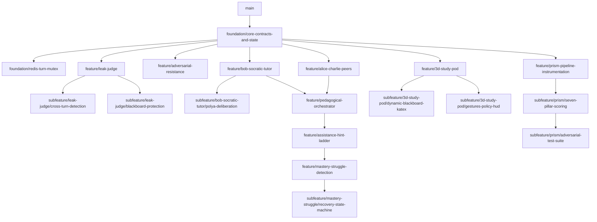

# Spatial PeerRing — Team Implementation Plan & Architecture Guide

> **Target Team Members:** `nad` (Foundation & Governance Architect), `usm` (Agent Intelligence & Adaptive Engine Lead), `muw` (Spatial UI & PRISM Observability Lead).  
> **Source Documents:** [Spatial-PeerRing-Consolidated-PRD.md](file:///c:/Users/ceusm/peerring/Spatial-PeerRing-Consolidated-PRD.md), [PRISM-Integration-Guide.md](file:///c:/Users/ceusm/peerring/PRISM-Integration-Guide.md), [feature-development-roadmap.md](file:///c:/Users/ceusm/peerring/feature-development-roadmap.md).

---

## 1. Executive Summary & Strategy for Feature Independence

The primary engineering goal of this implementation plan is to allow **`nad`**, **`usm`**, and **`muw`** to work concurrently with zero merge conflicts or blocking dependencies. 

To achieve this:
1. **`nad` builds a strict, decoupled Foundation first (`foundation/core-contracts-and-state`)**. This establishes frozen Pydantic state schemas, abstract base classes (`BaseAgent`, `BaseJudge`), mock fallback registries, and a contract-first event protocol.
2. **Upstream/Downstream decoupling**: `usm` (building agents/orchestration) and `muw` (building 3D UI & PRISM) consume contract stubs and typed Pydantic models. Neither relies on live LLM implementations to build and test their components.
3. **Sub-Branching Strategy**: Connected or dependent features use parent-child sub-branches (e.g., `feature/mastery-struggle` → `subfeature/recovery-fsm`). Sub-branches depend ONLY on contract abstractions merged into `main`, allowing child branches to be developed independently before parent feature completion.

---

## 2. Team Role Allocation Matrix

| Team Member | Role & Responsibilities | Core Focus Areas | Key Feature Branches |
|---|---|---|---|
| **`nad`** | **Foundation & Governance Lead** | Core Pydantic state, Redis mutex, FastAPI gateway, contract interfaces, Answer Governance (Leak/Help Judge, Rewriter, Adversarial Resistance). | `foundation/core-contracts-and-state`, `foundation/redis-turn-mutex`, `feature/leak-judge`, `feature/help-judge-rewriter`, `feature/cross-turn-blackboard-guardrails`, `feature/adversarial-resistance` |
| **`usm`** | **Agent Intelligence & Adaptive Lead** | Socratic tutor (Bob), peer agents (Alice/Charlie), Pólya deliberation, Pedagogical Orchestrator, Adaptive Policy, Mastery tracking, Recovery FSM. | `feature/bob-socratic-tutor`, `feature/alice-charlie-peers`, `feature/polya-deliberation`, `feature/pedagogical-orchestrator`, `feature/assistance-hint-ladder`, `feature/mastery-struggle-detection`, `subfeature/recovery-state-machine` |
| **`muw`** | **Spatial UI & PRISM Observability Lead** | React Three Fiber 3D Study Pod, KaTeX Dynamic Blackboard, Avatars & Gestures, Live Policy HUD, PRISM Telemetry pipeline, 7-Pillar scoring, Trust Pack, Adversarial test suite. | `feature/3d-study-pod`, `feature/dynamic-blackboard-katex`, `feature/gestures-policy-hud`, `feature/prism-pipeline-instrumentation`, `feature/prism-seven-pillar-scoring`, `feature/prism-adversarial-test-suite`, `feature/voice-lip-sync-polish` |

---

## 3. Overall Technical Architecture Plan

### 3.1 Layered Architecture Diagram

```
┌──────────────────────────────────────────────────────────────────────────────────┐
│ CLIENT TIER (Next.js 14 / React Three Fiber) — Owned by muw                     │
│   3D Study Pod (R3F)  │  Dynamic Blackboard (KaTeX)  │  Live Policy / PRISM HUD  │
└─────────────────────────────────────────▲────────────────────────────────────────┘
                                          │ WebSocket (JSON Event Stream)
┌─────────────────────────────────────────▼────────────────────────────────────────┐
│ GATEWAY TIER (FastAPI & Redis) — Owned by nad                                   │
│   Connection Manager  │  Session Auth  │  Redis 7.2 Mutex (`SETNX session:lock`)│
└─────────────────────────────────────────▲────────────────────────────────────────┘
                                          │
┌─────────────────────────────────────────▼────────────────────────────────────────┐
│ CORE AGENTIC ENGINE (LangGraph) — Owned by usm                                  │
│   Turn Allocator (Deterministic FSM) ──► Pedagogical Orchestrator (Dynamic Pick) │
│   Agents: Bob (Tutor) │ Alice (Arithmetic Peer) │ Charlie (Conceptual Peer)      │
│   Latent Pólya Deliberation (`<think>`) │ Adaptive Policy & Recovery FSM         │
└─────────────────────────────────────────▲────────────────────────────────────────┘
                                          │
┌─────────────────────────────────────────▼────────────────────────────────────────┐
│ GOVERNANCE & INTERCEPTION TIER — Owned by nad                                    │
│   Adversarial Resistance ──► Leak Judge ──► Help Judge ──► Policy Rewriter      │
└─────────────────────────────────────────▲────────────────────────────────────────┘
                                          │ Async (Off Request Path)
┌─────────────────────────────────────────▼────────────────────────────────────────┐
│ OBSERVABILITY & EVALUATION TIER (Block Convey PRISM) — Owned by muw             │
│   `prismtrace-sdk` ──► 7-Pillar Scoring ──► Trust Pack ──► Adversarial Test Suite│
└──────────────────────────────────────────────────────────────────────────────────┘
```

### 3.2 Data Flow per Turn (Sequence of Execution)

1. **User Input Ingestion**: `muw`'s frontend sends WebSocket frame `USER_MESSAGE` to `nad`'s FastAPI Gateway.
2. **Turn Locking**: Gateway acquires Redis turn lock (`SETNX session:turn_lock:{id}`).
3. **State & Adaptive Update**: `nad`'s central state loads from Redis; `usm`'s Adaptive Policy Engine calculates struggle/mastery scores.
4. **Orchestrator Selection**: `usm`'s Pedagogical Orchestrator collects candidate actions from Bob, Alice, and Charlie, scoring them based on policy and cooldowns.
5. **Agent Generation & Pólya Reasoning**: Winning agent executes Latent Pólya Deliberation (`<think>`) and generates visible dialogue + optional `blackboard_patch`.
6. **Governance Interception**: `nad`'s Leak Judge and Help Judge evaluate text + visual patch. On rejection, Policy Rewriter regenerates output with violation rationale.
7. **PRISM Instrumentation**: `muw`'s PRISM SDK handler async-records trace data (input, `<think>`, output, judge verdicts, latency, tokens) without blocking response delivery.
8. **Client Dispatch & Unlock**: Gateway streams response over WebSocket to `muw`'s frontend (triggering avatar gestures, KaTeX blackboard patch, HUD updates). On client ACK, Redis turn lock is released.

---

## 4. Decoupled Foundation Plan (nad's Deliverable)

Before any feature branches diverge, **`nad`** must implement the core contracts in `foundation/core-contracts-and-state`:

### 4.1 Frozen Core Contracts (`app/contracts/`)
- `BaseAgent`: Abstract class defining `async def propose_candidate_action(state: PeerRingState) -> CandidateAction` and `async def generate_response(state: PeerRingState, action: CandidateAction) -> AgentResponse`.
- `BaseJudge`: Abstract class defining `async def evaluate(text: str, patch: str | None, state: PeerRingState) -> JudgeVerdict`.
- `PeerRingState`: Centralized Pydantic v2 schema holding dialogue history, current step, curriculum mastery DAG, active policy level, and turn lock status.
- `MockAgentRegistry`: Mock implementations for Bob, Alice, Charlie, Leak Judge, and Blackboard so `muw` and `usm` can write tests independently.

---

## 5. Git Branching & Sub-Branching Strategy

### 5.1 Naming Rules
- **Foundation Branch**: `foundation/<component-name>` (Merged first into `main`).
- **Independent Feature Branches**: `feature/<epic>-<feature-name>` (Cut directly from `main` after foundation merge).
- **Dependent Sub-Branches**: `subfeature/<parent-feature>/<subfeature-name>` (Cut from parent feature branch or `main` using stubs).

### 5.2 Branch Dependency Tree & Sub-Branch Map



---

## 6. Categorized Feature Branches: Detailed Implementation Plan

---

### Category A — Agent Intelligence & Pedagogy

#### Feature Branch A1: `feature/bob-socratic-tutor`
- **Owner:** `usm`
- **Sub-Branch Suggestion:** `subfeature/bob-socratic-tutor/polya-deliberation` (Handles hidden `<think>` reasoning logic).
- **Technical Solution:** Implements `BobAgent` extending `BaseAgent`. Uses a system prompt mandating diagnostic probing and strict non-disclosure. Generates a `<think>` block (Pólya 4-step) before visible response.
- **Step-by-Step Implementation:**
  1. Create `backend/app/agents/bob.py` extending `BaseAgent`.
  2. Implement prompt template with diagnostic state parser.
  3. Implement `propose_candidate_action` scoring pedagogical value.
  4. Write unit tests in `backend/tests/agents/test_bob.py` using `MockJudge`.
- **PRISM Integration:** Logs `agent_id="bob-tutor"` and emits `<think>` block in trace metadata.
- **Needed Documentation:** `docs/branches/feature-bob-socratic-tutor.md` (Prompt specifications and Socratic questioning constraints).
- **Feature Folder Structure:**
  ```
  backend/app/agents/bob.py
  backend/app/prompts/bob_socratic.py
  backend/tests/agents/test_bob.py
  docs/branches/feature-bob-socratic-tutor.md
  ```

---

#### Feature Branch A2: `feature/alice-charlie-peers`
- **Owner:** `usm`
- **Sub-Branch Suggestion:** `subfeature/alice-charlie-peers/error-generators` (Implements distinct error generation rules).
- **Technical Solution:** Builds `AlicePeer` (arithmetic error peer) and `CharliePeer` (conceptual error peer). Uses distinct system prompts to guarantee zero overlap in mistake categories.
- **Step-by-Step Implementation:**
  1. Create `backend/app/agents/alice.py` (arithmetic error generator).
  2. Create `backend/app/agents/charlie.py` (conceptual/procedural misconception generator).
  3. Enforce strict error taxonomy validation in output parsers.
  4. Write unit tests validating error type isolation.
- **PRISM Integration:** Logs `agent_id="alice-peer"` and `agent_id="charlie-peer"`.
- **Needed Documentation:** `docs/branches/feature-alice-charlie-peers.md` (Error taxonomy definition and peer prompts).
- **Feature Folder Structure:**
  ```
  backend/app/agents/alice.py
  backend/app/agents/charlie.py
  backend/app/prompts/peer_alice.py
  backend/app/prompts/peer_charlie.py
  backend/tests/agents/test_peers.py
  ```

---

#### Feature Branch A3: `feature/pedagogical-orchestrator`
- **Owner:** `usm`
- **Sub-Branch Suggestion:** `subfeature/pedagogical-orchestrator/cooldown-rules` (Manages agent selection cooldowns).
- **Technical Solution:** Replaces static turn loops with a dynamic candidate scoring engine. Receives `CandidateAction` from Bob, Alice, and Charlie, applies strategy cooldown filters, and selects the optimal next speaker.
- **Step-by-Step Implementation:**
  1. Create `backend/app/agents/orchestrator.py`.
  2. Implement candidate scoring algorithm: `Score = PedagogicalUtility * (1 - CooldownPenalty)`.
  3. Integrate with central LangGraph turn node.
  4. Write tests for dynamic speaker transition across 10-turn mock sessions.
- **PRISM Integration:** Records candidate scores and winning agent decision as orchestrator metadata.
- **Needed Documentation:** `docs/branches/feature-pedagogical-orchestrator.md` (Orchestrator scoring formula & state machine).
- **Feature Folder Structure:**
  ```
  backend/app/agents/orchestrator.py
  backend/app/agents/candidate_scorer.py
  backend/tests/agents/test_orchestrator.py
  ```

---

### Category B — Answer Governance & Guardrails

#### Feature Branch B1: `feature/leak-judge`
- **Owner:** `nad`
- **Sub-Branch Suggestion:** `subfeature/leak-judge/cross-turn-detection` (Tracks dialogue history for split leaks).
- **Sub-Branch Suggestion:** `subfeature/leak-judge/blackboard-protection` (Inspects SVG/KaTeX blackboard patches).
- **Technical Solution:** Out-of-band classifier running on fast inference (<250ms). Evaluates proposed text and blackboard patches against curriculum step target solution.
- **Step-by-Step Implementation:**
  1. Create `backend/app/governance/leak_judge.py`.
  2. Define binary leak classification prompt & solution reconstructibility test.
  3. Create AST validator for mathematical expression comparison.
  4. Implement async evaluation gate in pipeline.
- **PRISM Integration:** Emits manual trace with `agent_id="leak-judge"` and `metadata={"leak_detected": bool, "policy_score": float}` off the critical request path.
- **Needed Documentation:** `docs/branches/feature-leak-judge.md` (Leak classification criteria and benchmark suite).
- **Feature Folder Structure:**
  ```
  backend/app/governance/leak_judge.py
  backend/app/governance/math_ast.py
  backend/tests/governance/test_leak_judge.py
  ```

---

#### Feature Branch B2: `feature/help-judge-rewriter`
- **Owner:** `nad`
- **Sub-Branch Suggestion:** None (Direct child of B1).
- **Technical Solution:** Second-pass evaluator (`HelpJudge`) verifying response helpfulness. On Leak or Help failure, `PolicyRewriter` regenerates candidate output using explicit violation feedback.
- **Step-by-Step Implementation:**
  1. Create `backend/app/governance/help_judge.py`.
  2. Create `backend/app/governance/policy_rewriter.py`.
  3. Wire retry loop (max 2 attempts) before throwing fallback response.
  4. Test rewrite efficacy on known leaking prompts.
- **PRISM Integration:** Logs `agent_id="help-judge"` and `agent_id="policy-rewriter"` with rejection reasons.
- **Needed Documentation:** `docs/branches/feature-help-judge-rewriter.md` (Helpfulness rubric & rewrite loop spec).
- **Feature Folder Structure:**
  ```
  backend/app/governance/help_judge.py
  backend/app/governance/policy_rewriter.py
  backend/tests/governance/test_rewriter.py
  ```

---

#### Feature Branch B3: `feature/adversarial-resistance`
- **Owner:** `nad`
- **Sub-Branch Suggestion:** None.
- **Technical Solution:** Intent classifier for incoming user frames (`NORMAL_QUESTION`, `ADVERSARIAL_INJECTION`, `SOLUTION_DEMAND`). Applies strict policy constraint flags to upstream agent generation.
- **Step-by-Step Implementation:**
  1. Create `backend/app/governance/adversarial_classifier.py`.
  2. Implement injection pattern matcher + LLM intent classifier.
  3. Inject `strict_mode=True` flag into `PeerRingState` when injection detected.
- **PRISM Integration:** Emits intent classification logs and flags high-risk sessions.
- **Needed Documentation:** `docs/branches/feature-adversarial-resistance.md` (Adversarial attack taxonomy).
- **Feature Folder Structure:**
  ```
  backend/app/governance/adversarial_classifier.py
  backend/tests/governance/test_adversarial.py
  ```

---

### Category C & D — Adaptive Learning, Personalization & Recovery

#### Feature Branch C1: `feature/assistance-hint-ladder`
- **Owner:** `usm`
- **Sub-Branch Suggestion:** None.
- **Technical Solution:** Maintains behavior-derived assistance level (1 to 6). Adjusts policy dynamically based on consecutive errors, hint dependency, and latency.
- **Step-by-Step Implementation:**
  1. Create `backend/app/adaptive/hint_ladder.py`.
  2. Implement level transition logic (`step_up`, `step_down`, `return_to_independence`).
  3. Unit test ladder movement across simulated student trajectories.
- **PRISM Integration:** Records active hint level per turn in trace metadata.
- **Needed Documentation:** `docs/branches/feature-assistance-hint-ladder.md` (Hint ladder levels specification).
- **Feature Folder Structure:**
  ```
  backend/app/adaptive/hint_ladder.py
  backend/tests/adaptive/test_hint_ladder.py
  ```

---

#### Feature Branch C2: `feature/mastery-struggle-detection`
- **Owner:** `usm`
- **Sub-Branch Suggestion:** `subfeature/mastery-struggle/recovery-state-machine` (Triggers recovery when stuck score > threshold).
- **Technical Solution:** Tracks per-concept mastery on a curriculum DAG (`distributive_property: 0.42`). Computes composite struggle score. When struggle threshold is breached, triggers `RecoveryStateMachine`.
- **Step-by-Step Implementation:**
  1. Create `backend/app/adaptive/mastery_dag.py`.
  2. Create `backend/app/adaptive/struggle_detector.py`.
  3. Create `backend/app/recovery/state_machine.py` (`NORMAL → SCAFFOLD → PREREQUISITE_REPAIR → MICRO_TEACHING`).
  4. Write tests for curriculum backtracking and Bob tutor takeover.
- **PRISM Integration:** Emits `mastery_delta` and `struggle_score` for PRISM 7th Pillar (Learning Progress).
- **Needed Documentation:** `docs/branches/feature-mastery-struggle-detection.md` (Curriculum DAG schema & recovery states).
- **Feature Folder Structure:**
  ```
  backend/app/adaptive/mastery_dag.py
  backend/app/adaptive/struggle_detector.py
  backend/app/recovery/state_machine.py
  backend/app/recovery/prerequisite_backtrack.py
  backend/tests/adaptive/test_mastery_recovery.py
  ```

---

### Category F — Spatial Presentation Layer (Frontend)

#### Feature Branch F1: `feature/3d-study-pod`
- **Owner:** `muw`
- **Sub-Branch Suggestion:** `subfeature/3d-study-pod/dynamic-blackboard-katex` (KaTeX Math canvas rendering).
- **Sub-Branch Suggestion:** `subfeature/3d-study-pod/gestures-policy-hud` (Avatars, Gestures & Live Policy HUD).
- **Technical Solution:** React Three Fiber 3D scene with compressed GLTF avatars for Bob, Alice, Charlie, and User. Synchronizes canvas via `blackboard_patch` WebSocket events and displays live policy HUD.
- **Step-by-Step Implementation:**
  1. Set up Next.js 14 + R3F Canvas in `frontend/src/components/spatial/StudyPod.tsx`.
  2. Add Draco-compressed avatar loader & lighting setup.
  3. Build `frontend/src/components/blackboard/KaTeXBoard.tsx`.
  4. Build `frontend/src/components/hud/PolicyHUD.tsx` displaying current speaker, leak check status, and mastery score.
- **PRISM Integration:** Displays PRISM session ID and live trust metrics in HUD.
- **Needed Documentation:** `docs/branches/feature-3d-study-pod.md` (3D scene specs, asset guidelines, WebSocket event schemas).
- **Feature Folder Structure:**
  ```
  frontend/src/components/spatial/StudyPod.tsx
  frontend/src/components/spatial/Avatar.tsx
  frontend/src/components/blackboard/KaTeXBoard.tsx
  frontend/src/components/hud/PolicyHUD.tsx
  frontend/src/hooks/useWebSocket.ts
  ```

---

### Category G — PRISM Observability & Evaluation

#### Feature Branch G1: `feature/prism-pipeline-instrumentation`
- **Owner:** `muw`
- **Sub-Branch Suggestion:** `subfeature/prism/seven-pillar-scoring` (Implements 7-pillar evaluation pipeline).
- **Sub-Branch Suggestion:** `subfeature/prism/adversarial-test-suite` (Automated evaluation suite & Trust Pack generator).
- **Technical Solution:** Integrates `prismtrace-sdk`. Wraps LangGraph engine with `wrap_langgraph` and sets up ambient `prismtrace.session()` context per WebSocket connection. Implements 7-Pillar scoring + automated Trust Pack exporter.
- **Step-by-Step Implementation:**
  1. Create `backend/app/telemetry/prism_client.py` using `prismtrace-sdk`.
  2. Implement ambient session handler in WebSocket router.
  3. Build 7-Pillar scorer module (`backend/app/telemetry/pillar_scorer.py`).
  4. Build automated Trust Pack report generator and endpoint (`POST /api/v1/test/run-prism-suite`).
- **PRISM Integration:** Complete full-pipeline telemetry integration (the core audit trail).
- **Needed Documentation:** `docs/branches/feature-prism-pipeline-instrumentation.md` (PRISM integration, environment keys, 7-pillar math).
- **Feature Folder Structure:**
  ```
  backend/app/telemetry/prism_client.py
  backend/app/telemetry/pillar_scorer.py
  backend/app/telemetry/trust_pack.py
  backend/app/api/eval_routes.py
  backend/tests/telemetry/test_prism_integration.py
  ```

---

## 7. Overall Workspace Folder Structure

Below is the complete file structure of the `peerring` repository once all feature branches are merged:

```
peerring/
├── .agent/                             # Agent workspace configuration & skills
├── backend/
│   ├── app/
│   │   ├── main.py                     # FastAPI application entrypoint & startup handlers
│   │   ├── config.py                   # Environment settings (PRISM keys, Redis URL, LLM credentials)
│   │   ├── api/
│   │   │   ├── ws_router.py            # WebSocket connection manager & ambient session handler
│   │   │   ├── health_routes.py        # Setup-doctor & health checks
│   │   │   └── eval_routes.py          # PRISM evaluation suite & Trust Pack export routes
│   │   ├── state/
│   │   │   ├── pydantic_state.py       # Centralized PeerRingState schema
│   │   │   └── redis_mutex.py          # Turn Allocator FSM & Redis SETNX mutex lock
│   │   ├── contracts/                  # Abstract Base Classes & Interfaces (nad)
│   │   │   ├── base_agent.py
│   │   │   ├── base_judge.py
│   │   │   └── mock_registry.py
│   │   ├── agents/                     # Socratic Tutor & Peer Agents (usm)
│   │   │   ├── bob.py                  # Bob Socratic Tutor
│   │   │   ├── alice.py                # Alice Arithmetic Error Peer
│   │   │   ├── charlie.py              # Charlie Conceptual Error Peer
│   │   │   └── orchestrator.py         # Pedagogical Orchestrator & Candidate Scorer
│   │   ├── governance/                 # Interception & Guardrails (nad)
│   │   │   ├── leak_judge.py           # Out-of-band Leak Judge
│   │   │   ├── help_judge.py           # Second-pass Help Judge
│   │   │   ├── policy_rewriter.py      # Response regeneration engine
│   │   │   ├── math_ast.py             # Math expression AST comparator
│   │   │   └── adversarial_classifier.py # User intent classifier & injection defense
│   │   ├── adaptive/                   # Adaptive Policy & Personalization (usm)
│   │   │   ├── hint_ladder.py          # 6-level escalating assistance ladder
│   │   │   ├── mastery_dag.py          # Curriculum DAG & node mastery tracking
│   │   │   └── struggle_detector.py    # Composite stuck score algorithm
│   │   ├── recovery/                   # Pedagogical Recovery Engine (usm)
│   │   │   ├── state_machine.py        # Recovery state transition machine
│   │   │   └── prerequisite_backtrack.py # DAG backtracking & Bob tutor takeover
│   │   └── telemetry/                  # PRISM Telemetry & Evaluation (muw)
│   │       ├── prism_client.py         # prismtrace-sdk client & LangGraph wrapper
│   │       ├── pillar_scorer.py        # 7-Pillar scoring engine (including Learning Progress)
│   │       └── trust_pack.py           # Baseline vs. Upgraded Trust Pack generator
│   ├── tests/
│   │   ├── agents/                     # Agent unit & integration tests
│   │   ├── governance/                 # Leak/Help Judge benchmark suites
│   │   ├── adaptive/                   # Mastery & hint ladder tests
│   │   └── telemetry/                  # PRISM smoke & handshake tests
│   ├── pyproject.toml
│   └── requirements.txt
├── frontend/
│   ├── src/
│   │   ├── app/                        # Next.js 14 App Router
│   │   │   ├── page.tsx                # Main 3D Study Pod workspace page
│   │   │   ├── layout.tsx
│   │   │   └── globals.css
│   │   ├── components/
│   │   │   ├── spatial/                # React Three Fiber components (muw)
│   │   │   │   ├── StudyPod.tsx        # 3D Scene canvas
│   │   │   │   ├── Avatar.tsx          # GLTF character renderer
│   │   │   │   └── Lighting.tsx        # Scene illumination & shadows
│   │   │   ├── blackboard/             # Dynamic Blackboard (muw)
│   │   │   │   └── KaTeXBoard.tsx      # SVG/KaTeX mathematical patch renderer
│   │   │   ├── hud/                    # Trust & Telemetry HUD (muw)
│   │   │   │   ├── PolicyHUD.tsx       # Live status, active agent, leak check indicator
│   │   │   │   └── PRISMStats.tsx      # Real-time session metrics
│   │   │   └── chat/                   # Dialogue UI
│   │   │       └── MessageList.tsx
│   │   ├── hooks/
│   │   │   ├── useWebSocket.ts         # Real-time event streaming & turn lock ACK
│   │   │   └── useStudyPodState.ts     # Spatial state & gesture dispatch
│   │   └── types/
│   │       └── index.ts                # TypeScript types mirroring backend state
│   ├── public/                         # Avatars, GLTF models, textures
│   ├── package.json
│   └── tsconfig.json
├── docs/
│   ├── architecture/                   # High-level design & diagrams
│   └── branches/                       # Feature-branch specific documentation
│       ├── foundation-contracts.md
│       ├── feature-bob-socratic-tutor.md
│       ├── feature-alice-charlie-peers.md
│       ├── feature-pedagogical-orchestrator.md
│       ├── feature-leak-judge.md
│       ├── feature-help-judge-rewriter.md
│       ├── feature-adversarial-resistance.md
│       ├── feature-assistance-hint-ladder.md
│       ├── feature-mastery-struggle-detection.md
│       ├── feature-3d-study-pod.md
│       └── feature-prism-pipeline-instrumentation.md
├── PRISM-Integration-Guide.md
├── Spatial-PeerRing-Consolidated-PRD.md
├── feature-development-roadmap.md
└── team-implementation-plan.md
```

---

## 8. Feature-by-Feature Folder Mapping Table

This matrix maps every feature to its owner, branch name, sub-branch suggestion, primary code location, and required documentation:

| Feature ID & Name | Branch Name | Sub-Branch Suggestion | Owner | Primary Code Paths | Branch Documentation File |
|---|---|---|---|---|---|
| **E1: Pydantic State & Contracts** | `foundation/core-contracts-and-state` | None | **`nad`** | `backend/app/state/pydantic_state.py`, `backend/app/contracts/` | `docs/branches/foundation-contracts.md` |
| **E2: Redis Turn Mutex & FSM** | `foundation/redis-turn-mutex` | None | **`nad`** | `backend/app/state/redis_mutex.py`, `backend/app/api/ws_router.py` | `docs/branches/foundation-redis-mutex.md` |
| **A1: Bob (Socratic Tutor)** | `feature/bob-socratic-tutor` | `subfeature/bob-socratic-tutor/polya-deliberation` | **`usm`** | `backend/app/agents/bob.py`, `backend/app/prompts/bob_socratic.py` | `docs/branches/feature-bob-socratic-tutor.md` |
| **A2 & A3: Alice & Charlie Peers** | `feature/alice-charlie-peers` | `subfeature/alice-charlie-peers/error-generators` | **`usm`** | `backend/app/agents/alice.py`, `backend/app/agents/charlie.py` | `docs/branches/feature-alice-charlie-peers.md` |
| **A5: Pedagogical Orchestrator** | `feature/pedagogical-orchestrator` | `subfeature/pedagogical-orchestrator/cooldown-rules` | **`usm`** | `backend/app/agents/orchestrator.py` | `docs/branches/feature-pedagogical-orchestrator.md` |
| **B1: Leak Judge** | `feature/leak-judge` | `subfeature/leak-judge/cross-turn-detection` | **`nad`** | `backend/app/governance/leak_judge.py`, `backend/app/governance/math_ast.py` | `docs/branches/feature-leak-judge.md` |
| **B4 & B5: Help Judge & Rewriter** | `feature/help-judge-rewriter` | None | **`nad`** | `backend/app/governance/help_judge.py`, `backend/app/governance/policy_rewriter.py` | `docs/branches/feature-help-judge-rewriter.md` |
| **B6: Adversarial Resistance** | `feature/adversarial-resistance` | None | **`nad`** | `backend/app/governance/adversarial_classifier.py` | `docs/branches/feature-adversarial-resistance.md` |
| **C1 & C3: Assistance & Hint Ladder** | `feature/assistance-hint-ladder` | None | **`usm`** | `backend/app/adaptive/hint_ladder.py` | `docs/branches/feature-assistance-hint-ladder.md` |
| **C2, C4, D1-D4: Mastery & Recovery** | `feature/mastery-struggle-detection` | `subfeature/mastery-struggle/recovery-state-machine` | **`usm`** | `backend/app/adaptive/mastery_dag.py`, `backend/app/recovery/` | `docs/branches/feature-mastery-struggle-detection.md` |
| **F1-F4: 3D Pod, Blackboard & HUD** | `feature/3d-study-pod` | `subfeature/3d-study-pod/dynamic-blackboard-katex`, `subfeature/3d-study-pod/gestures-policy-hud` | **`muw`** | `frontend/src/components/spatial/`, `frontend/src/components/hud/` | `docs/branches/feature-3d-study-pod.md` |
| **G1-G5: PRISM Tracing & Eval** | `feature/prism-pipeline-instrumentation` | `subfeature/prism/seven-pillar-scoring`, `subfeature/prism/adversarial-test-suite` | **`muw`** | `backend/app/telemetry/`, `backend/app/api/eval_routes.py` | `docs/branches/feature-prism-pipeline-instrumentation.md` |

---

## 9. Verification & Quality Assurance Plan

1. **Foundation Smoke Check**: `nad` runs `pytest backend/tests/contracts/` to verify mock agents and central state serialization.
2. **Agent Unit Testing**: `usm` runs `pytest backend/tests/agents/` ensuring Bob never outputs terminal answers in unit scenarios.
3. **Governance Stress Benchmark**: `nad` runs `pytest backend/tests/governance/` with 50 adversarial benchmark prompts.
4. **PRISM Integration Doctor**: `muw` executes `curl -sS "$PRISMTRACE_HOST/api/setup-doctor?project_id=$PRISMTRACE_PROJECT_ID"` confirming live trace connectivity.
5. **End-to-End Handshake**: Full team runs `npm run dev` (Frontend) + `uvicorn app.main:app` (Backend) to test 3D rendering, blackboard math patches, leak intercepts, and HUD updates simultaneously.
